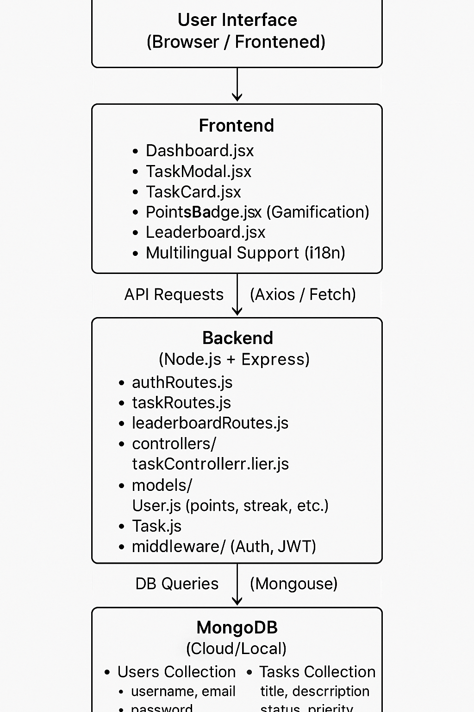

# Collaborative ToDo List App

SyncSphTere is a collaborative ToDo List web application built with a full-stack architecture using **React**, **Node.js**, and **MongoDB**. It includes gamification features like **streaks**, **points**, and a **leaderboard** to encourage productivity in a fun and competitive way.

---

## 🚀 Features

- ✅ Create, edit, delete, and complete tasks
- 📆 Set due dates and track progress
- 🔁 Daily streaks and reward points for completed tasks
- 🏆 Global leaderboard based on streaks and task completion
- 👥 User authentication with session handling
- 🌐 Responsive UI using TailwindCSS and Bootstrap
- 🌍 Multi-language support (i18n)

---

## 📸 Demo Video

👉 Watch the walkthrough of the app:  
[Loom Video - App Demonstration](https://www.loom.com/share/607687094185499caa664fed710ee0e5?sid=eff8a03a-0c37-4a31-94f8-f08f0decc6c7)

---

## 🖼️ Architecture Diagram



> The architecture follows a typical MERN stack pattern with RESTful API endpoints and React handling the UI state and routing.

---

## 🛠️ Tech Stack

- **Frontend**: React + Vite, Tailwind CSS, Bootstrap
- **Backend**: Node.js, Express
- **Database**: MongoDB (with Mongoose)
- **Authentication**: JWT & Cookies
- **Routing**: React Router
- **i18n**: `react-i18next`

---

## 📦 Setup Instructions

1. **Clone the repository**

   ```bash
   git clone https://github.com/Roopasree7/Todo-List.git
   cd Todo-List
<<<<<<< HEAD

 **This project is a part of a hackathon run by 
https://www.katomaran.com**
=======
>>>>>>> 9de5acb (updated)
